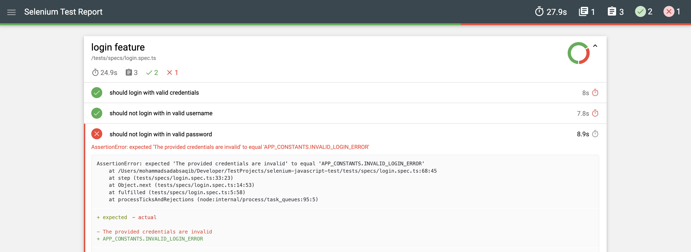

# Selenium Webdriver Test Framework
This is a sample project that uses selenium, typescript, mocha and chai.

### Requirements
[](https://nodejs.org/en/download/)
[](https://docs.docker.com/get-docker/)
[](https://code.visualstudio.com/download)

### Getting Started

Clone Repository

```bash
git clone https://github.com/sadabnepal/selenium-javascript-test.git
cd selenium-javascript-test
```

Install packages:

```bash
npm install
```

Setup husky:

```bash
npm run prepare
```

Run tests:

```bash
npm run test
```

Lint & fix

```bash
npm run lint
npm run lint:fix
```

Run test on Docker
```bash
npm run docker:start        [ start the docker container ]
npm run docker:stop         [ stop the docker container ]

npm run docker:start:arm    [ start the docker container for mac m1 chip ]
npm run docker:stop:arm     [ stop the docker container for mac m1 chip ]
```

Sample Report


### Key Features
- Custom types for browser
- Support to run test with all major browser
- Parallel execution with mocha framework
- Docker for testing against/using containerization
- dotenv to support multiple environment
- eslint linting tools integrated
- husky git hooks for pre-commit checks (eslint)

### learning references:
| topic           | references                                                  |
|-----------------|-------------------------------------------------------------|
| selenium        | https://www.npmjs.com/package/selenium-webdriver            |
| mocha           | https://ricostacruz.com/mocha/                              |
| mocha config    | https://github.com/mochajs/mocha/tree/master/example/config |
| chai            | https://www.chaijs.com                                      |
| report          | https://github.com/adamgruber/mochawesome                   |
| dotenv          | https://www.npmjs.com/package/dotenv                        |
| eslint          | https://eslint.org/docs/latest/use/getting-started          |
| vscode settings | https://code.visualstudio.com/docs/getstarted/settings      |